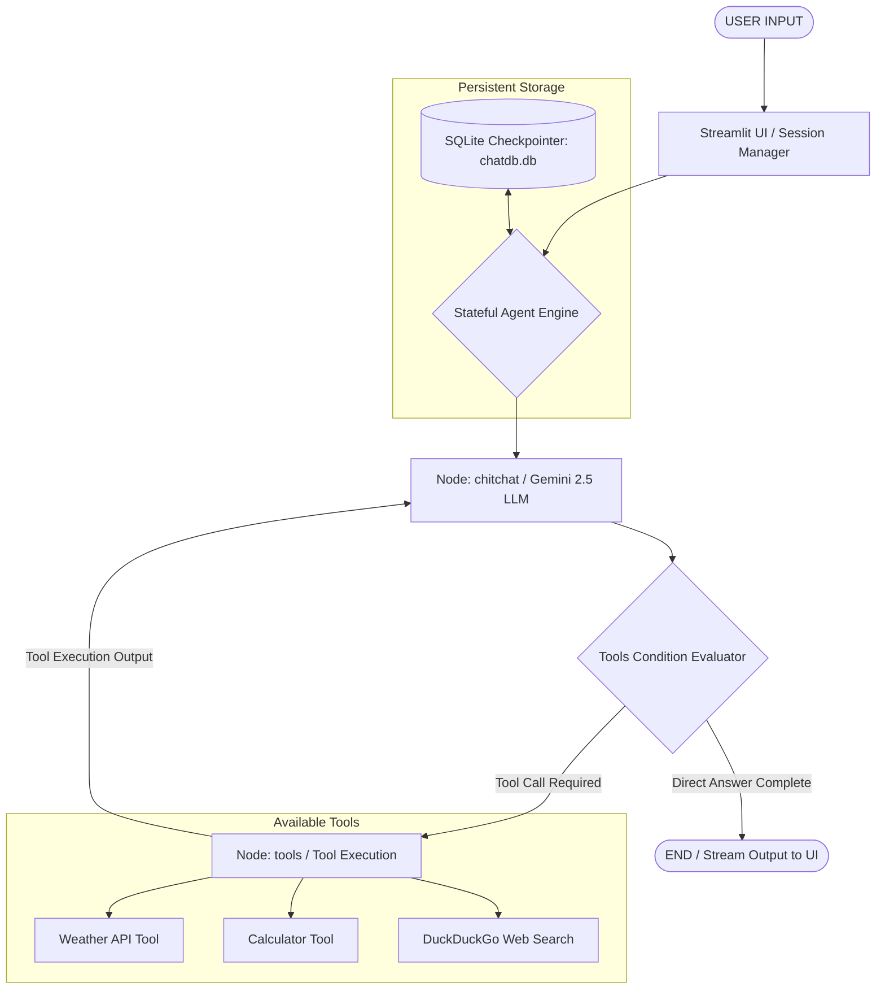

# Autonomous Agentic AI System with Dynamic Tool Integration & Persistent Memory

An End-to-End Autonomous AI Agent Application Built with **Google Gemini 2.5 Flash**, **Streamlit**, **SQLite Checkpointing**, and **Python**.

---

## 📌 Executive Summary

This project demonstrates the design and implementation of an **Agentic AI Assistant** capable of autonomous reasoning, dynamic tool selection, external API interaction, and persistent conversational memory across sessions.

Unlike conventional static chatbot pipelines, this architecture utilizes a **state-driven autonomous agent workflow**. The AI engine dynamically evaluates user queries to decide whether to answer directly using its parametric knowledge or invoke external domain tools (such as real-time weather APIs, arithmetic calculators, and web search engines) before formulating a final response.

---

## 🏗️ System Architecture & Workflow

The core reasoning engine is built as a stateful event-loop architecture where conversation states are saved to an SQLite database checkpoint after each transition.



### Execution Flow:
1. **User Query Input**: The user sends a prompt via the Streamlit interactive chat interface.
2. **State Initialization**: The message is added to the state reducer (`add_messages`) under a unique `thread_id`.
3. **LLM Reasoning Node (`chitchat`)**: The system prompt and message history are passed to `Gemini 2.5 Flash`, which evaluates if domain tools are required.
4. **Conditional Routing (`tools_condition`)**:
   - **If Tool Required**: Execution branches to tool execution, where the corresponding tool function (`calculator`, `getweather`, or `DuckDuckGoSearchRun`) is invoked. The output is fed back to the LLM node.
   - **If No Tool Needed**: Execution terminates (`END`) and the response streams back to the UI.
5. **State Persistence**: The complete execution state and history are committed to SQLite (`chatdb.db`).

---

## 🚀 Key Features

- **Agentic Decision-Making & Tool Binding**: The LLM intelligently binds to external tools and determines arguments autonomously based on prompt context.
- **Persistent Conversation Threads**: Full session memory using an SQLite Checkpointer. Users can switch between previous chat threads or start new sessions without losing context.
- **Real-Time Token Streaming**: Leverages message streaming events (`stream_mode='messages'`) for low-latency response delivery in Streamlit.
- **Error-Resilient Custom Tools**: Includes defensive exception handling (e.g., zero-division checks in math functions, HTTP status validation for API requests).

---

## 🛠️ Tool Definitions & Integration

| Tool Name | Type | Description / Capability |
| :--- | :--- | :--- |
| `getweather` | Custom `@tool` | Queries live weather data from **WeatherAPI** (`api.weatherapi.com`) via HTTP GET requests. |
| `calculator` | Custom `@tool` | Performs exact floating-point arithmetic (Addition, Subtraction, Multiplication, Division) with zero-division error handling. |
| `search_tool` | Search Tool | Performs live web searches via `DuckDuckGoSearchRun` for up-to-date real-world facts. |

---

## 💻 Tech Stack & Dependencies

- **Language**: Python 3.10+
- **LLM Engine**: `ChatGoogleGenerativeAI` (`gemini-2.5-flash`)
- **Frontend UI**: `Streamlit`
- **Database / Memory**: SQLite3 (`SqliteSaver` checkpointer)
- **External APIs**: WeatherAPI, DuckDuckGo Search API

---

## 📂 Project Structure

```
AgenticAi/
│
├── tool_backend.py          # Stateful agent backend, tool definitions, and SQLite checkpointer
├── tool_frontend.py         # Streamlit UI with multi-thread sidebar & streaming chat output
├── .gitignore               # Excludes secrets (.env), database files (*.db), and virtual environments
├── requirements.txt         # Project dependencies
└── README.md                # System documentation
```

---

## 🔬 Technical Implementation Deep Dive

### 1. State Schema & Message Reducer
The state is managed as a `TypedDict` using `add_messages` reducer to atomically append incoming messages:
```python
class chatState(TypedDict):
    messages: Annotated[list[BaseMessage], add_messages]
```

### 2. Multi-Thread Memory Management
Thread IDs are generated using `uuid.uuid4()`. Saved thread IDs are dynamically fetched from the database checkpointer using `checkpoint.list(None)`:
```python
def find_all_thread():
    threads = set()
    for point in checkpoint.list(None):
        threads.add(point.config['configurable']['thread_id'])
    return threads
```

---

## ⚙️ Installation & Setup Guide

### 1. Prerequisites
- Python 3.10 or higher
- Google Gemini API Key
- WeatherAPI Key ([weatherapi.com](https://www.weatherapi.com/))

### 2. Clone Repository
```bash
git clone https://github.com/raykundan655/ai-tool-assistant.git
cd ai-tool-assistant
```

### 3. Create & Activate Virtual Environment
```bash
# Windows
python -m venv myenv
myenv\Scripts\activate

# Linux/macOS
python3 -m venv myenv
source myenv/bin/activate
```

### 4. Install Requirements
```bash
pip install -r requirements.txt
```

### 5. Configure Environment Variables
Create a `.env` file in the root directory:
```env
GOOGLE_API_KEY=your_google_gemini_api_key_here
WEATHER_API_KEY=your_weather_api_key_here
```

### 6. Run Application
```bash
streamlit run tool_frontend.py
```

---

## 🎯 Demonstration Scenarios for Evaluation

1. **Tool Invocation Test (Weather)**:
   - *Prompt*: "What is the current weather in Tokyo?"
   - *Behavior*: The LLM recognizes the city entity, invokes `getweather("Tokyo")`, parses the JSON output, and formats a user-friendly weather report.
2. **Tool Invocation Test (Calculator)**:
   - *Prompt*: "Divide 54321 by 123."
   - *Behavior*: Routes to `calculator(54321, 123, 'divide')` for exact numerical results rather than LLM calculation approximation.
3. **Multi-Turn Thread Switching**:
   - *Behavior*: Create a new chat session in the sidebar, talk, then switch back to previous threads. The system loads exact message logs from `chatdb.db`.

---

## 📜 Author & Acknowledgments

- **Developer**: Mahi (`raikundan655@gmail.com`)
- **Technologies**: Built using [Google Generative AI API](https://ai.google.dev/), Python, and [Streamlit](https://streamlit.io/).
